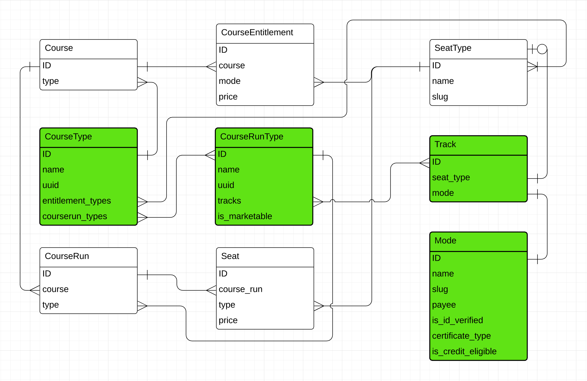

LMS Course Types in Course Metadata
===================================

Status
------

Accepted

Terminology
-----------

Product - A Seat or Entitlement that is offered in the E-Commerce service.

Mode - The LMS Course Run mode available. In the edX ecosystem, these would
be Audit, Verified, Professional, No ID Professional, Credit, Masters, and
Honor.

Context
-------

Course Metadata keeps its own record of two types of E-Commerce Products:
Seats for Course Runs and Entitlements for Courses.

In the past, Course Discovery did not have reliable knowledge about the
connection between E-Commerce and the LMS in terms of E-Commerce Products and
LMS Course Run Modes. In order to determine anything about the LMS Modes,
Course Discovery would have to look at the Seats that exist for a particular
Course Run in Course Metadata and infer from there. This was possible when
Seats and Entitlements had a one-to-one mapping to the current LMS Modes that
existed.

However, with the inclusion of Masters, we saw a divergence between Seats in
Course Metadata and the products in E-Commerce. Masters is a LMS Course Run
Mode, but has no E-Commerce products associated with it, breaking our earlier
assumption of Seats being used to inform on LMS and E-Commerce. Additionally,
the E-Commerce Data Loader (part of the refresh_course_metadata management job
in Course Discovery) syncs Course Metadata with E-Commerce, so when the
data loader sees Seats in Course Metadata that have no E-Commerce counterpart,
it deletes the Seats out of Course Metadata. This situation has now led to
Course Runs in Course Metadata that have no Seats so there is no good way of
determining the LMS Mode.

The problem we are trying to solve is this then: how to cleanly define the
combinations of LMS Modes and E-Commerce Products that exist for our various
Course / Course Run use cases. The goal is for this model to also be easily
expanded as new Products or Modes are added. Additionally, we want Course
Discovery to remain a source of truth for this information so we want to also
be able to keep track of metadata associated with Products or Modes.

Decision
--------

In order to accommodate both E-Commerce Products and LMS Modes in Course
Discovery, we have decided to add in four new models.

The first is the Mode model, the LMS Mode equivalent to the SeatType
model. The idea behind this is to allow SeatType to be the connection of the
types in the E-Commerce service and Mode to be the connection to the LMS
Modes. This model will also be able to keep track of a number of metadata
fields about the different Modes (such as if the Mode requires ID
verification or who the payee is for the track).

The second model is the Track model. This model will contain fields for the
Mode selection as well as the Product (Seat) associated with that selection.
Two examples of Tracks are::

    mode: Verified, seat_type: Verified (indicates Verified Seat in E-Commerce)
    mode: Masters, seat_type: None (indicates there is no E-Commerce Product)

The third model is CourseRunType, the connector between a Course Run and its
Tracks. CourseRunType will also be able to contain run-specific information,
such as if this run has a marketing site or not.
An example of CourseRunType::

    One row in the CourseRunType could have the label "Verified and Audit" and
    the Audit and Verified Tracks. This would mean any Course Runs pointing at
    this row would have Verified and Audit Tracks in the LMS and Verified and
    Audit Seats in E-Commerce.

    A similar, but different situation, would be the CourseRunType row for
    "Masters, Verified, and Audit". Any Course Runs that are connected to this
    row will have Masters, Verified, and Audit Tracks. In this case, the course
    runs will have all three Modes, but will continue to only have Verified and
    Audit Seats in E-Commerce since Masters does not have any E-Commerce
    Products associated with it.

The last model is the CourseType model, the connector between the Course, its
Products (Entitlements), and the allowed CourseRunTypes for its Course Runs.
The CourseType will contain information that will reduce the possible
selections for its Course Runs and this will also determine if an Entitlement
is needed. Example::

    CourseType could have the row "Masters, Verified, and Audit". This would
    indicate that any of the Course Runs inside this Course could have any
    allowed permutation in CourseRunType that makes sense with this Course
    selection. Examples of possible CourseRunTypes are:
        * "Masters, Verified, and Audit"
        * "Verified and Audit"
        * "Audit only"
        * "Masters only"
    This selection would also mean a Verified Entitlement should be made in
    E-Commerce since it is possible for some of its Course Runs to be Verified.

It is believed this new format will be more resilient and explicit moving
forward in Course Discovery. It will allow for clear specification at both the
Course and Course Run levels for what type it is and what Products are
associated with that selection.

Entity Relationship Diagram:

Update November 18, 2019:
-------------------------

We are more broadly allowing mismatches between a Course's CourseType and its
Course Runs' CourseRunType. A mismatch is defined as when a Course Run's
CourseRunType is not one of the CourseRunTypes listed under the CourseType's
Many to Many relationship with CourseRunType. We see the use case of this
being a way to support Course Runs that do not fit the mold of a particular
CourseType, despite most of the other Course Runs matching. One example would
be having several Course Runs that all have Verified and Audit seats, but one
Course Run having no seats. In the past, there would be no CourseType match
because a Course Run having no seats does not exist within any CourseType. By
allowing mismatches, this Course could have the Verified and Audit CourseType
and the Course Run with no seats could have the Empty CourseRunType.

It is worth noting that within edX, we are using mismatches as a way of
supporting historical oddities in our system. We do not encourage using
mismatches generally or as a best practice, but more as a way of dealing with
oddities that do not require full CourseType support.

Update June 12, 2020:
---------------------

As we began releasing the newest Open edX release (Juniper), it became clear that we made some misses in regards to the defaults provided to the Open edX community. As of the date of writing, we are adding in support for Honor into the defaults provided through migrations. Course Types are still intended to be customizable to each Open edX installation, but we want to do our best to widely support common cases. With that idea in mind, I am documenting below the list of all of the default Course Types, Course Run Types, Tracks, and Modes that will come with running migrations. The table includes each Course Type and the connections to all of its children.

+------------------------+-----------------------+--------------+--------------+--------------+
| Course Type            | Course Run Type       | Track        | Mode         | Seat Type    |
+========================+=======================+==============+==============+==============+
| Audit Only             | Audit Only            | Audit        | Audit        | Audit        |
+------------------------+-----------------------+--------------+--------------+--------------+
| Professional Only      | Professional Only     | Professional | Professional | Professional |
+------------------------+-----------------------+--------------+--------------+--------------+
| Verified and Audit     | Audit Only            | Audit        | Audit        | Audit        |
|                        +-----------------------+--------------+--------------+--------------+
|                        | Verified and Audit    | Audit        | Audit        | Audit        |
|                        |                       +--------------+--------------+--------------+
|                        |                       | Verified     | Verified     | Verified     |
+------------------------+-----------------------+--------------+--------------+--------------+
| Credit                 | Audit Only            | Audit        | Audit        | Audit        |
|                        +-----------------------+--------------+--------------+--------------+
|                        | Verified and Audit    | Audit        | Audit        | Audit        |
|                        |                       +--------------+--------------+--------------+
|                        |                       | Verified     | Verified     | Verified     |
|                        +-----------------------+--------------+--------------+--------------+
|                        | Credit                | Audit        | Audit        | Audit        |
|                        |                       +--------------+--------------+--------------+
|                        |                       | Verified     | Verified     | Verified     |
|                        |                       +--------------+--------------+--------------+
|                        |                       | Credit       | Credit       | Credit       |
+------------------------+-----------------------+--------------+--------------+--------------+
| Honor Only             | Honor Only            | Honor        | Honor        | Honor        |
+------------------------+-----------------------+--------------+--------------+--------------+
| Verified and Honor     | Honor Only            | Honor        | Honor        | Honor        |
|                        +-----------------------+--------------+--------------+--------------+
|                        | Verified and Honor    | Honor        | Honor        | Honor        |
|                        |                       +--------------+--------------+--------------+
|                        |                       | Verified     | Verified     | Verified     |
+------------------------+-----------------------+--------------+--------------+--------------+
| Credit with Honor      | Honor Only            | Honor        | Honor        | Honor        |
|                        +-----------------------+--------------+--------------+--------------+
|                        | Verified and Honor    | Honor        | Honor        | Honor        |
|                        |                       +--------------+--------------+--------------+
|                        |                       | Verified     | Verified     | Verified     |
|                        +-----------------------+--------------+--------------+--------------+
|                        | Credit with Honor     | Honor        | Honor        | Honor        |
|                        |                       +--------------+--------------+--------------+
|                        |                       | Verified     | Verified     | Verified     |
|                        |                       +--------------+--------------+--------------+
|                        |                       | Credit       | Credit       | Credit       |
+------------------------+-----------------------+--------------+--------------+--------------+

If you're only curious about which models exist (the distinct values from each column above), they are listed below:

:Course Type: Audit Only, Professional Only, Verified and Audit, Credit, Honor Only, Verified and Honor, and Credit with Honor
:Course Run Type: Audit Only, Professional Only, Verified and Audit, Credit, Honor Only, Verified and Honor, and Credit with Honor
:Track: Audit, Professional, Verified, Credit, and Honor
:Mode: Audit, Professional, Verified, Credit, and Honor
:Seat Type: Audit, Professional, Verified, Credit, and Honor

-------

We added in a script to the Refresh Course Metadata command to do a best effort matching of the Courses/Course Runs with their corresponding Course Types and Course Run Types. The script that attempts to do the matching can be found at: ``course_discovery/apps/course_metadata/data_loaders/course_type.py``. It tries to look at the Entitlements associated with the Course and the Seats associated with all of the Course Runs for that Course. From all this information, it will try and find a Course Type and Course Run Types that match.

We believe through the initial migrations adding in Course Types, Course Run Types, Tracks, and Modes, we have covered many of the common cases. We do however recognize that we cannot plan for every possibility and it is possible to encounter an error when running Refresh Course Metadata. This error will look like

::

    Calculating course type failure occurred for [{course_key}].

From there, you can look into the Course Discovery Admin (Django Admin) to try and see why this may have happened. The first place to check would the Entitlement associated with the failing Course. The only Entitlements supported by default are Verified and Professional Entitlements and the Course Type must also have it set (for example, Audit Only and Honor Only have no Entitlement). If the Entitlement does not line up with any Course Type, that would be the first thing to fix. This can either be done via adding your Entitlement type to the correct Course Type or by creating a new Course Type (more on this later).

The next place to check is by pulling up all of the Course Runs associated with the failing Course and looking at their Seats. The Seats must match up with a Course Run Type (see the corresponding Seat Type column in the rows with the Course Run Type). Remember that all Course Run Types listed under a Course Type are all applicable to be matched with. Example: A Course Type of Verified and Audit can have Course Runs matching either Audit Only or Verified and Audit. If your Course Run Seats do not match any Course Run Types (via the Track's Mode and Seat Type), you can either add the appropriate Tracks to the Course Run Type or create a new Course Run Type (see below). Hopefully through these steps, you can find where the disconnect is happening between the expected values from the table and what is actually happening in your Open edX installation.

There is an additional scenario worth covering which is if you have created your own LMS Modes or E-Commerce Seats or Entitlements. In this case, you will need to create a new Course Type to match your system. I would start in this case by making a Mode that corresponds to the LMS Course Mode for your Course Runs and a Seat Type that corresponds to the E-Commerce Seat type. From there, you can create the Track for the newly created Mode and Seat Type. Then you can set up the CourseRunType to utilize the Track and finally the CourseType that includes the CourseRunType. This logic can also be expanded to create multiple Modes, Tracks, CourseRunTypes, and CourseTypes as applicable to your system. It can also be helpful keeping in mind that Course Types can include many Course Run Types.

Alternative Approaches Considered
---------------------------------

**No major data model changes (continue to infer LMS Tracks based on Products
in Course Metadata)** - One option would be to just not change the current
infrastructure to accommodate for LMS Tracks inside of Course Discovery. This
option would still require making changes to work for the Masters case, but
could be done with a smaller overhaul. This option was rejected as it was
decided there would be current and future benefit in having a clear connection
from Course Discovery to both E-Commerce and LMS. One such benefit is being
able to make the SeatType model the source of truth for what types of Products
we offer, whereas currently Masters exists as a SeatType despite never
existing inside of E-Commerce.

**Allowing selection of all Tracks** - In the examples above, the option for
CourseType and CourseRunType always followed the form of a label ("Verified
and Audit"). Another option we considered was allowing the user to simply
select all of the types they wanted in their Course or Course Run. For
example, with the "Verified and Audit" case, the user would select a
"Verified" option and an "Audit" option. This path was decided against due to
the complex nature of our Course and Course Run types. For example, we do not
allow a single Course to have the Professional type and
any other type (Professional must exist on its own). Another example is how we
will have a type that looks the same, but differs in a few ways. This
situation happens when we have a standard Audit Course Run and a Small Private
Online Course (SPOC). In both cases, the LMS Track is Audit, but the SPOC has
no E-Commerce Products and no marketing page whereas the the standard Audit
Course has both. For these reasons, it was decided that providing only labels
to the user will allow us to encapsulate the underlying logic and abstract
away the implementation details of concepts such as "Audit".
